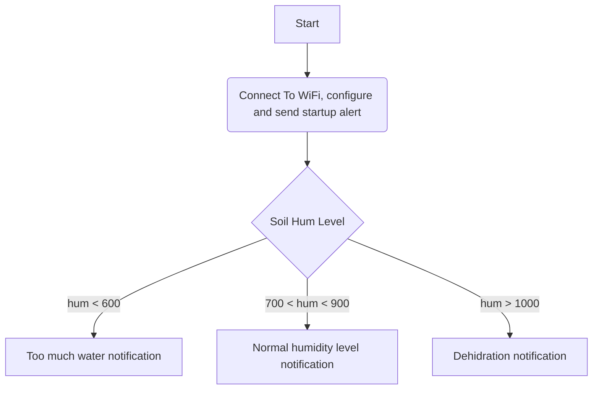

# EKO-Telegram-Soil-Sensor
This project uses an ESP8266 and an analog Capacitive Soil Sensor to alert a user of it's plant health

# Requirements 
This repo uses the [universal-telegram-bot-library](https://github.com/witnessmenow/Universal-Arduino-Telegram-Bot) as a basis for sending messages using a Telegram Bot, need to have that installed first.

Also a Telegram Bot is needed, for that we use Telegram and by messaging [BotFather](https://telegram.me/botfather) with the `/newbot` command. From there we can name our bot and add a profile picture for it. After that BotFather will give us the Access Token for that Bot in the following form `XXXXXXXXX:XXXXXXXXXXXXXXXXXXXXXXXXXXXXXXXXXXX`. Take note of it and do not share it with anyone.

For our own Telegram user we need to grab our ID, and for that we message [UserInfoBot](https://telegram.me/userinfobot) with the `/start` command. Save the 9-Digit ID for later

